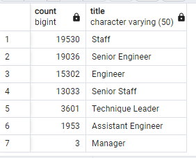

# Pewlett-Hackard-Analysis
---
## Overview of the Analysis:
The purpose of this analysis was to :analyze and filter employee data at Pewlett-Hackard using SQL to determine the number of retiring employees per title and identify employees who are eligible to participate in their mentorship program.

---
## Results: 
- In total, there are 72,458 employees who are up for retirement. Filtering by title, we have the below results for each title, so that departments can predict how many staff by department may need to be replaced in the upcoming year as employees retire.

- After close analysis of the mentorship eligibility table created through SQL and joining numerous csv's information on employees, we can see that 1549 employees are eligible for the mentorship program.

Data Resources: [retirement_titles.csv](Data/retirement_titles.csv), [mentorship_elgibility.csv](Data/mentorship_eligibility.csv)

---
## Summary: 
Several departments are having employees retire. Of those retirees, the top 3 departments that will need to be filled are Staff, Senior Engineers, and Engineers. A total of 72,458 roles could be potentially impacted as the "silver tsunami" approaches! 
Based on the number of mentorship eligible employees that are ready to mentor the next generation of Pewlett Hackard employees, it doesn't seem to be enough. With only 1549 employees ready, I don't believe that will be sufficient in mentoring a potential +70K new staff. That would be roughly 47 new incoming employees per mentor.